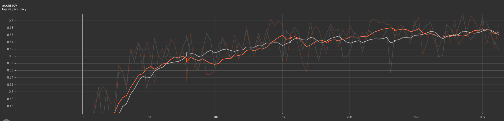

# Frequency transformation for image recognition and inpainting

### Initial result:
1. SVC on mnist 91% accuracy, SVC on fft from mnist 84%
2. Cifar-10 test 61% without fft, 69% with         
val accuracy - orange with fft, grey without          



### Steps to do:
- [ ] Test conda env
- [ ] Fourier torch implementation
- [ ] Wavelet torch implementation
- [ ] Finish la classifier
- [x] Training for model with/without fft
- [ ] Train bigger model to get bigger gap in performance
- [ ] Repeat la classifier and conv training for wavelet 
- [ ] Add results from lama with/without fft

### Installation
```bash
git clone https://github.com/igor185/frequency-for-receptive-field
cd frequency-for-receptive-field
git clone https://github.com/saic-mdal/lama # for comparing inpainting results (can be skipped)
conda env create -f env.yml
conda activate fft
```

### Running

Run la classification
```bash
python la_classification.py
```