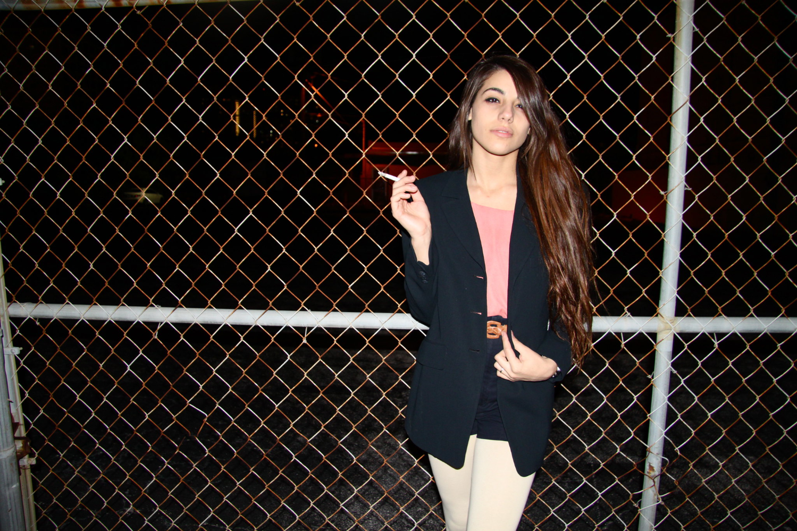
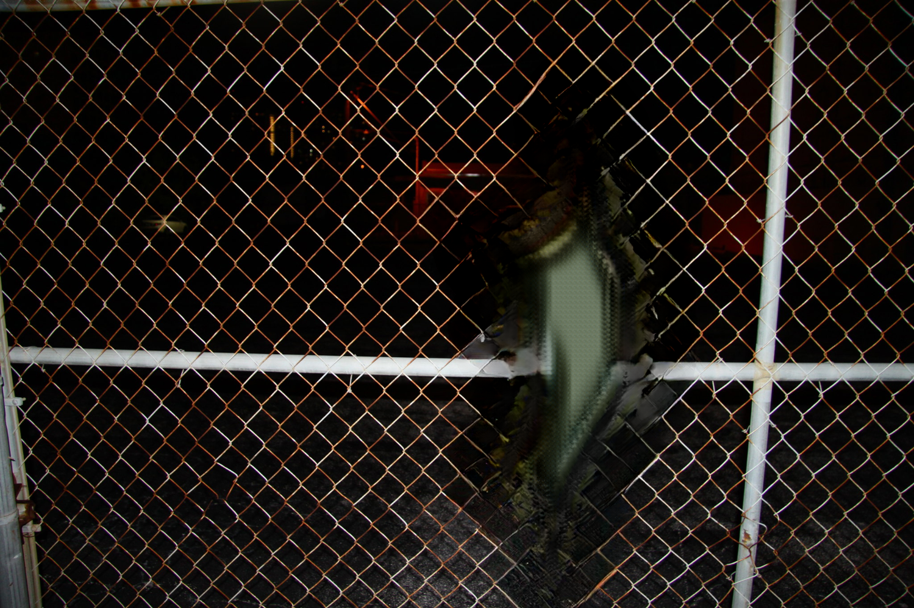
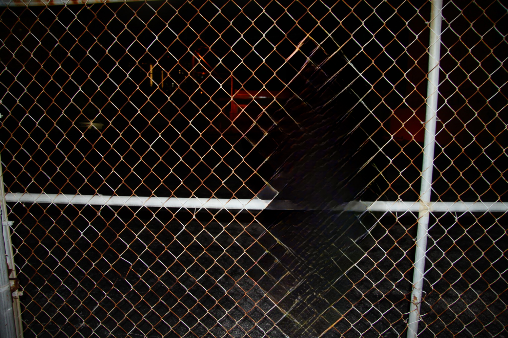
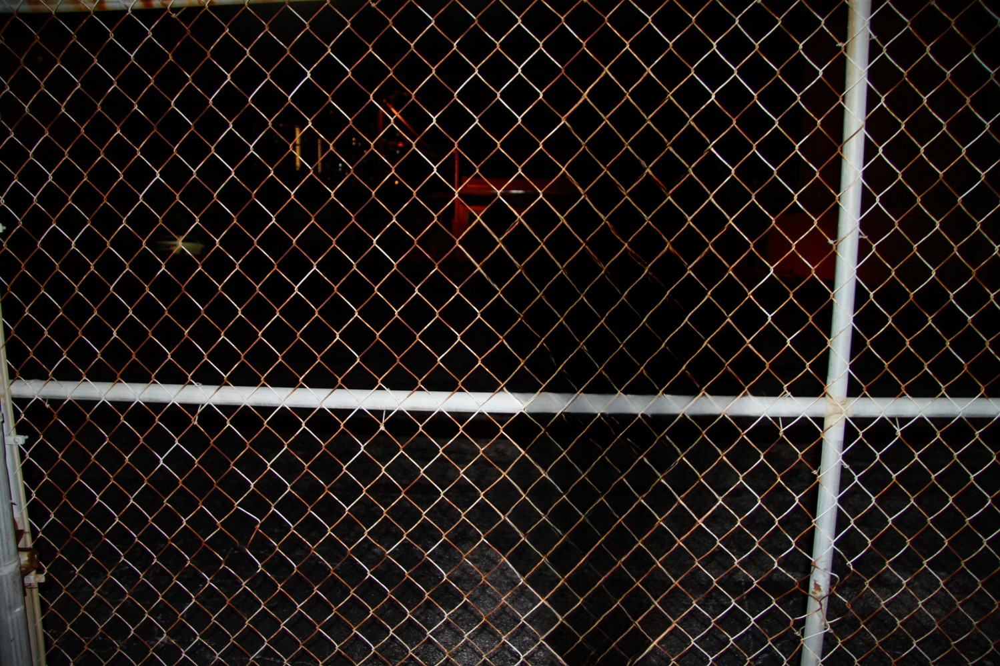

# Frequency transformation for image recognition and inpainting
Final report (in progress) [link](https://www.overleaf.com/project/63bef61cea42cfff2a2dfb5d)   
Presentation (in progress) [link](https://docs.google.com/presentation/d/1DP341sTM0YM-R4mEzm6WRv9LWwWa1mL8C3gzxZy4NuY/edit?usp=sharing)

### Steps to do:
- [x] Fourier torch implementation
- [ ] Wavelet torch implementation
- [ ] Finish la classifier
- [x] Train mnist and test on large-scale mnist
- [x] Training for model with/without fft
- [x] Train bigger model to get bigger gap in performance
- [x] Add results from lama with/without fft

### Installation
```bash
git clone https://github.com/igor185/frequency-for-receptive-field
cd frequency-for-receptive-field
conda env create -f env.yml
conda activate fft
```

### Running

Run la classification
```bash
python la_classification.py
```

Train and evaluate cifar-10
```bash
python main.py --model_type resnet18 --model conv --dataset cifar10 --seed 42 --epoch 200
python main.py --model_type resnet18 --model fourier --dataset cifar10 --seed 42 --epoch 200
```


## Results
- Classical classifiers (TODO):     
    - SVM on mnist 91% accuracy, SVM on fft from mnist 84%     
    -
- Deep learning classifiers:     
    - Network trained on raw pixel performs better then network train on frequencies from pixels    
    - Cifar-10: Network(one resnet block) with fft on deep features performs 3% better then network without fft
    - Mnist: tested on bigger size to see if fft helps to get better generalization, up to 15% accuracy on test bigger then without fft
- Inpainting results:
Input image:

Inpainting without fft and dilated conv:

Inpainting with dilated conv:

Inpainting with fft:
